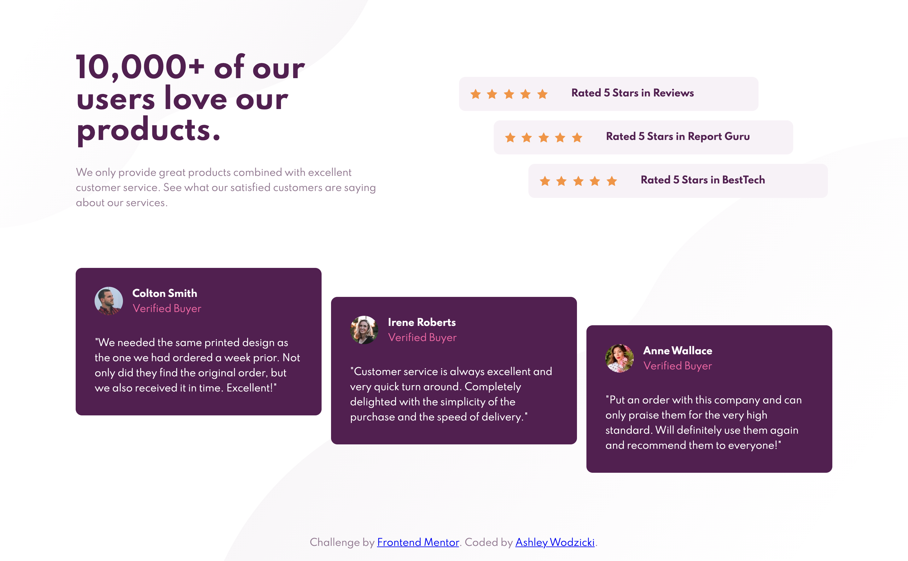

# Frontend Mentor - Social proof section solution

This is a solution to the [Social proof section challenge on Frontend Mentor](https://www.frontendmentor.io/challenges/social-proof-section-6e0qTv_bA). Frontend Mentor challenges help you improve your coding skills by building realistic projects.

## Table of contents

- [Overview](#overview)
  - [The challenge](#the-challenge)
  - [Screenshot](#screenshot)
- [My process](#my-process)
  - [Built with](#built-with)
  - [What I learned](#what-i-learned)
  - [Continued development](#continued-development)
  - [Useful resources](#useful-resources)
- [Author](#author)

## Overview
Welcome! 👋

Thanks for checking out my solution to this front-end coding challenge. This is my first Frontend Mentor project. I learned a lot and have written about my process and learning below.

### The challenge

Users should be able to:

- View the optimal layout for the section depending on their device's screen size

### Screenshot

## My process
- I used a mobile-first approach to start this project. I started with the HTML5 markup and created some base layout styles in css. I focused on general font size, weight, and colors. Then I worked my way down the page on aligning text and changing background colors on the top portion of the page. I focused padding to make each element look like the picture. After each element was correctly colored and individually styled, I added larger margins for the top of the page and other larger spaces on the page.
- The first time I started the desktop design, I was focusing on making a smooth transition from mobile to desktop. I knew I wanted to use flexbox to move the dark magenta review blocks into a horizontal row and I wanted the transition to look good at any viewport width. So, I went back into my mobile markup to create a flexbox, which I know now was a big mistake. After spending a few hours making adjustments to margins and padding, resizing the viewport again and again, and even finicking with font size to make the page look exactly like the sample picture, I realized I had made the markup too complicated. I took a step back and decided to go back to my original mobile and I decided I would not make changes to the original code.
- My second attempt at the desktop design went much smoother. I focused less on a smooth transition and accepted that sometimes transitions must be drastic in order to be functional and easily understood in my code. I created a grid for the top portion of the desktop site and a flexbox for the five star ratings. The reviews also became a flexbox and, with less complicated code, still transition well from mobile to desktop.

### Built with

- Semantic HTML5 markup
- CSS custom properties
- Flexbox
- CSS Grid
- Mobile-first workflow

### What I learned

- During this project, I learned that I should not make changes to my mobile code when trying to create the desktop version of a webpage. I spent hours trying to create a smooth transition and trying to condense my code as much as possible instead of focusing on adding changes into the media query. For example, the first time I attempted the desktop version, I made the mobile version of the reviews-container a flexbox. This affected my margins and a lot of my spacing on the mobile site. I now realize that the reviews-container did not have to be a flexbox on the mobile version in order to transition well into the desktop version. I learned that it is better to use a media query to add the flexbox at the viewport width that my mobile version started to break down.

- Another part of my code that I am proud of is utilizing the :nth-child() selector
When aligning the 3 five-star container items and the reviews, I originally thought I would have to give each container it's own class or ID to align it correctly. After reading about the :nth-child() selector on W3 schools, I was able to implement it into my flex boxes, as shown below.
`.rating-container :nth-child(2){
  align-self: center;
}
.rating-container :nth-child(3){
  align-self: flex-end;
}`

### Continued development

Use this section to outline areas that you want to continue focusing on in future projects. These could be concepts you're still not completely comfortable with or techniques you found useful that you want to refine and perfect.

### Useful resources

- [CSS Tricks flexbox](https://css-tricks.com/snippets/css/a-guide-to-flexbox/) - This helped me with aligning items correctly in the flexbox. I will continue to use this resource in the future.
- [Freecodecamp: Footer](https://www.freecodecamp.org/news/how-to-keep-your-footer-where-it-belongs-59c6aa05c59c/) - This article helped me better understand a page wrapper and how to keep a footer where it belongs. When I completed the mobile and desktop styles, I noticed my footer was being pushed out of the viewport when on the mobile view. At a certain width on the desktop view, the footer would also be in the middle of the last dark magenta review block. I was able to fix my footer following the advice from this page.

## Author

- Ashley Wodzicki
- Frontend Mentor - [@alwodzicki](https://www.frontendmentor.io/profile/alwodzicki)
- Twitter - [@ashwodz](https://www.twitter.com/ashwodz)
- Freecodecamp - [@awodzicki](https://www.freecodecamp.org/awodzicki)
